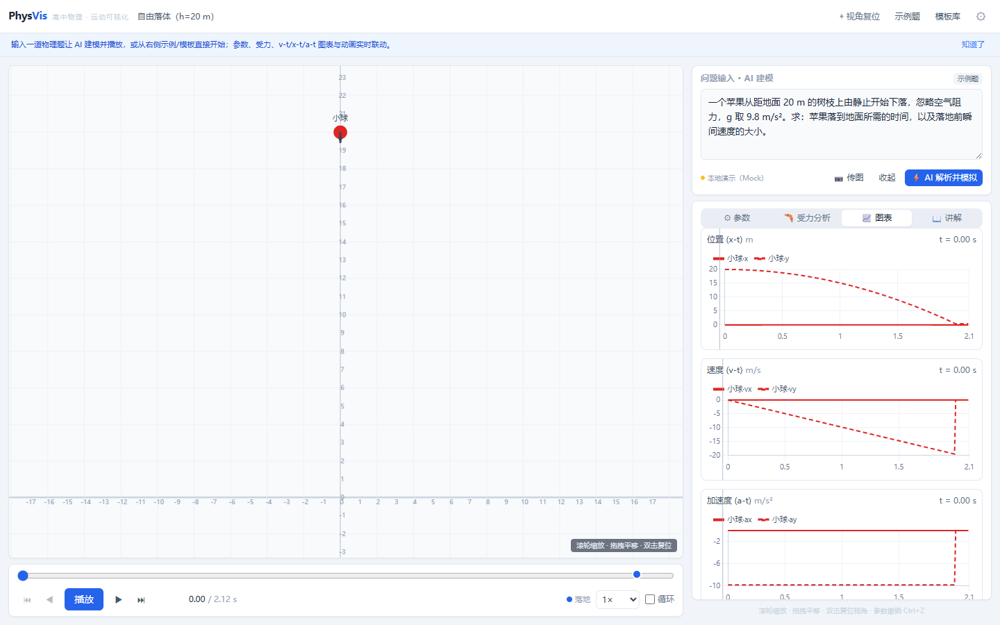
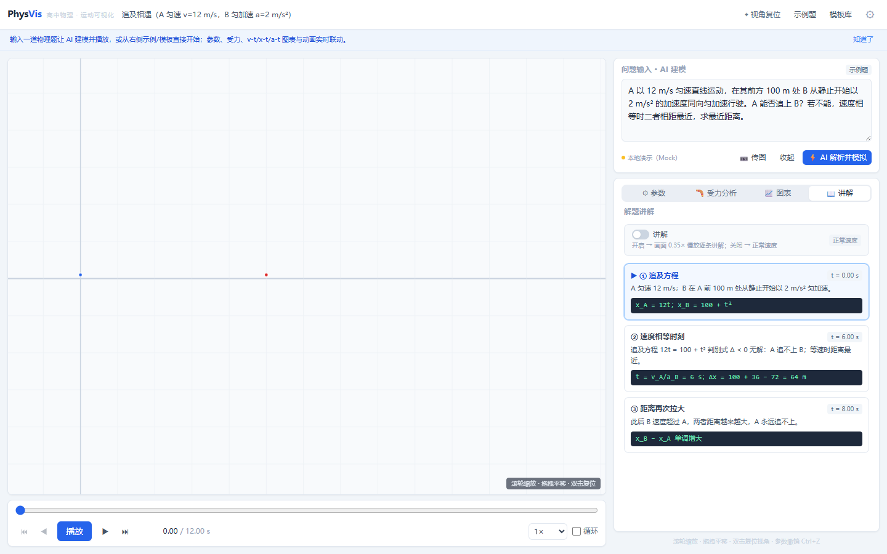
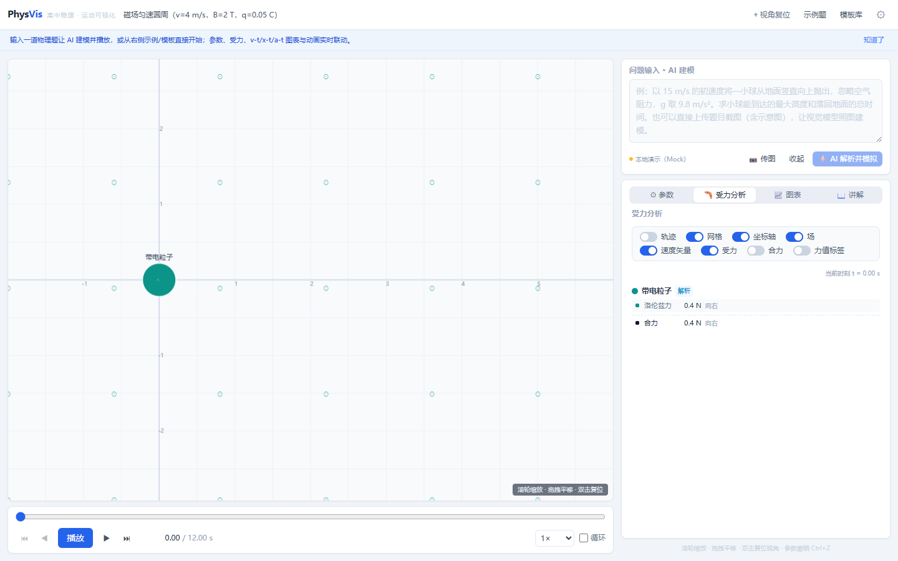

# PhysVis — 高中物理运动可视化

> 输入一道物理题（文本或截图），AI 解析建模，由精确物理引擎渲染成可交互 2D 动画 ——
> 实时调参、受力分析、x-t / v-t / a-t 联动图表、分步讲解。
> **纯前端、零后端、AI BYOK（自带 Key）**，覆盖高考「力与运动 + 电磁场」常见题型的准确模型。





> 需求与验收细节见 [docs/PhysVis-SPEC.md](docs/PhysVis-SPEC.md)。

## ✨ 功能特性

- **AI 题目解析（BYOK）**：题干文本或题目截图（≤3 张、≤4MB）→ 视觉模型识图 → zod schema + 物理合理性双重校验 → 失败自动重试、低置信弹「人工校正」窗口 → 自动建模
- **精确物理引擎**：解析解 + Velocity Verlet 混合求解（dt = 0.01 s 统一采样网格）；碰撞动量守恒、绳/杆约束、弹簧连接体、板块摩擦共速、圆环内壁接触均按物理规律求解
- **20 个场景模板**：
  - P0 基础运动：匀变速 / 自由落体 / 竖直上抛 / 平抛斜抛 / 匀速圆周 / 弹簧振子 / 单摆
  - P1 综合模型：斜面滑块 / 传送带 / 碰撞 / 追及相遇
  - P2 高考电磁与综合：带电粒子在匀强电场 / 磁场 / 组合场中的运动、圆环内壁与环内碰撞、竖直圆周（绳模型 / 杆模型，含过顶临界 √(5gL) 与脱绳）、弹簧连接体、板块模型
- **20 道内置示例题**：无 Key 也能离线走完「解析 → 校正 → 演示」全流程
- **分步讲解**：讲解步骤与画面时间严格同步；开启讲解自动 0.35× 慢放，点击步骤直接跳转
- **可视化**：受力矢量（分力开关 + 合力虚线 + 数值标签）、电场 / 磁场背景提示层、轨迹残影、事件标记（落地 / 碰撞 / 相遇 / 绳张紧，点击跳转）
- **联动图表**：x-t / v-t / a-t（每物体双分量），点击图表跳转播放头
- **实时调参**：每个物理量都有滑块与数值框（初速度、质量、场强、小球半径……），改参即时重算，Ctrl+Z/Y 撤销重做
- **播放控制**：播放 / 暂停 / 逐帧（±0.01s）/ 回放 / 速度调节 / 时间轴拖拽
- **现场恢复**：最近场景与题目持久化，刷新后自动恢复

## 🚀 在线演示

https://<你的用户名>.github.io/physvis/

## 📦 本地运行

要求 Node.js ≥ 20。

```bash
npm install
npm run dev        # 开发服务器 http://localhost:5173
npm run build      # 生产构建（tsc + vite build → dist/）
npm run preview    # 本地预览生产构建
npm test           # Vitest 引擎 / AI 层测试
npm run accept     # 浏览器端到端验收（先启动 dev，自动驱动本机 Edge）
```

`dist/` 产物完全静态：可直接部署到任意静态托管（GitHub Pages / Vercel / Nginx）。
也可打包 zip 发送 —— 资源为相对路径 + Hash 路由，部署在任意子路径均可；
zip 内含「启动PhysVis.cmd」一键脚本（自动起本地服务器并打开浏览器，需本机装有
Node.js 或 Python），或自行执行 `npx serve dist`。

## 🤖 AI 配置（BYOK）

PhysVis 不内置任何 AI 服务，所有请求从你的浏览器直连你配置的提供商：

| 通道 | 说明 | 图片识图 |
| --- | --- | --- |
| Mock（内置） | 无需 Key，离线演示全流程 | 演示 |
| DeepSeek | 如 `deepseek-chat`；识图需视觉模型（如 `deepseek-vl2`），否则上传图片会提示 | 取决于模型 |
| OpenAI 兼容 | OpenAI / Ollama / vLLM 等任意兼容端点 | 取决于模型 |
| Anthropic | Claude 系列 | ✅ |
| Google Gemini | Gemini 系列 | ✅ |

- Key 仅存本机 localStorage，随解析请求发送给你配置的 baseUrl，不经过任何第三方。
- 浏览器直连各厂商存在 CORS 差异，设置面板内置各厂商能力说明；
  本地 Ollama 需配置 `OLLAMA_ORIGINS`，OpenAI 常被 CORS 拦截可自建本地代理改 baseUrl。

## 🧪 测试与验收

- **单元测试（Vitest）**：引擎物理正确性断言 —— 解析 / 数值 parity、碰撞动量守恒、
  绳 / 杆约束长度不变、弹簧对严格守恒与简谐周期、磁场回旋半径 r=mv/qB 与周期、
  电场类平抛偏转、绳张紧事件时刻、板块共速与停止判定；AI 层 schema / 物理校验 / 往返与 mock 流程。
- **浏览器验收（33 项自动化冒烟）**：playwright-core 驱动本机 Edge（零浏览器下载），
  覆盖播放 / 逐帧 / 参数 / 撤销重做 / 图表 / 模板库 / 示例题 / 讲解慢放 / 识图上传等全流程。

## 📁 目录结构

```
src/
├── engine/        # 纯算法：types / Engine（混合模式 + 预计算缓存）/ solvers（解析、Verlet、力、碰撞、约束）/ events / camera
│   └── scenarios/ # 模板注册表：模板 = 参数化场景工厂（instantiate / applyValues）
├── ai/            # prompt 构建 → provider（4 通道 + mock，含图片视觉格式）→ zod 校验 → 物理校验 → mapper 建场景 → flow 编排
├── stores/        # simulationStore（场景 + 撤销 + 播放）/ settingsStore（Key 持久化）/ problemStore（题目 + 截图）/ uiStore
├── render/        # rAF 模块级单例 + 分层渲染 + 相机交互（SimulationCanvas / useSimulationLoop）
├── components/    # 面板 / 弹窗 / 讲解 / charts（Chart.js，DOM 时间游标零重绘）
├── pages/         # Workspace（单页应用，Hash 路由）
└── examples/      # 20 道内置示例题（含与仿真时间对齐的分步讲解）
```

核心设计决策：

- **急切全量预计算**：参数变更 → 同步重算整个结果（1~5 ms），不做惰性缓存；撤销栈存场景快照，切换时确定性重算
- **解析 / 数值同网格**：全部采样到 0.01 s 网格，UI 以「解析 / 数值」徽标区分求解方式
- **渲染零 React 重渲染**：播放时间由 rAF 直写 store，画布层每帧读 mutable 相机对象；图表时间游标用 DOM overlay transform
- **约束张紧相用角坐标半隐式积分**：绳 / 杆高速整圈不掉能量；弹簧对相对坐标解析简谐严格守恒；板块动摩擦一步收敛无极限环

## ⚖️ License

[MIT](LICENSE) © 2026 Byte
